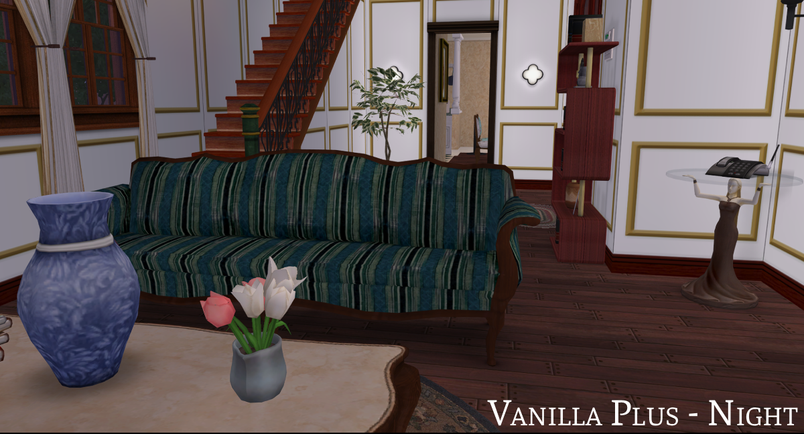
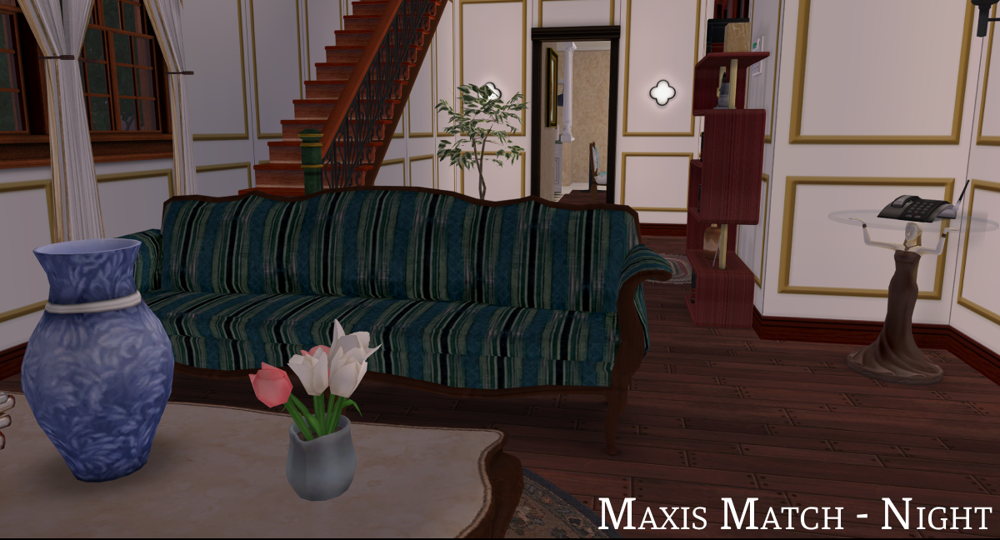
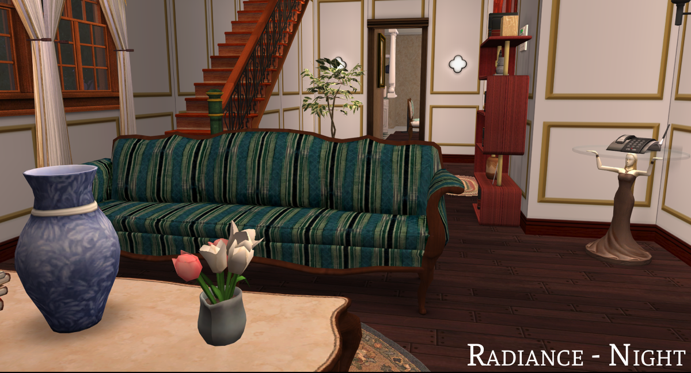
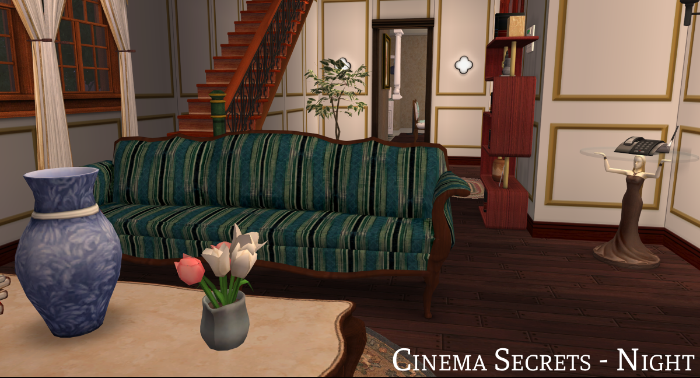
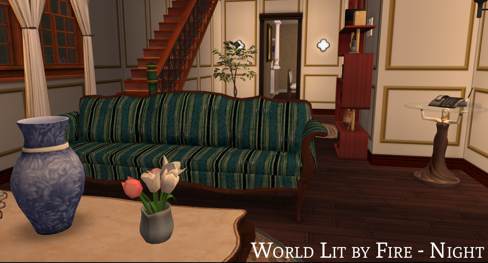

## **Lighting Mod Ultimate Collection**

### ABOUT

*(Yes, it’s a reference to the ultimate collection because…it is indeed an ultimate collection)*

The ***Lighting Mod Ultimate Collection*** is a lighting mod/framework that allows players to switch lighting configurations on a lot-level basis.

Now, the game itself already utilizes lot-level lighting as far back as Nightlife for Downtown lots, and some lighting mods have combined this with the usage of cheat aliases to use different lighting configurations that potentially suit different lots of neighborhoods, or using different lighting color definitions (as in Cinema Secrets’s implementation of World Lit by Fire), or the lighting direction changes in Maxis Match Lighting Mod.

However, the Lighting Mod Ultimate Collection takes this a step further and features five lighting mods in one setup. This means one installation and you can switch from one config to another on the fly.

Now, given the limitations of how lighting files are loaded, I used Cinema Secrets’s configuration as the base configuration, but ported as many configurations from the other lighting mods as I could while maintaining its stability. This means the only things that change from one mode to another are:

- Seasons lighting
- Time of day lighting (night, dusk, dawn)
- Lighting object definitions (the configurations that define what kind of light an object would have
- Some global definitions

Neighborhood lighting is the same across modes, as is CAS lighting, debug lighting, and certain global configurations

### **LIGHTING MODS**

#### 1. Cinema Secrets (DEFAULT)

This is the one I personally use, and is sort of a middle ground between more maxis-styled lighting and more realistic and dramatic lighting mods like the Radiance Lighting System. It aims to keep the stuff I like with MM Lighting Mod, but integrate some aspects I like in the Radiance Lighting Mod and try to fix issues that plagued both.

Cinema Secrets is the default lighting you will end up in if you don't switch to another mode.

#### 2. World Lit by Fire

This is a adaptation of the Radiance Lighting System tweaks by Almighty Hat that aims to add a candle light cast to all lights in the game that aren't supposed to be electric. However, I took this a step further and converted some of the electric lights to SoftAmber (if it makes sense).

Everything else is still based on Cinema Secrets.

#### 3. Maxis Match Lighting Mod

Maxis Match (MM) Lighting Mod is a lighting configuration mod for The Sims 2 that aims to improve on vanilla Maxis lighting, while at the same time retain its very essence. It had taken a life of its own ever since but it's still very maxis-matchy and uses Maxis lighting configuration across the board.

#### 4. Radiance Lighting System

The Radiance Lighting System, according to its original creator GunMod, is an "Enhanced lighting system for the Sims 2." that uses physics laws of light to ensure the most realistic lighting possible within the game.

The original mod has very dramatic lights and very dark darks, but I've put my own spin into it, adding in Radiance Lighting System fixes and tweaks on top of the 2.4 version by dDefender - dusk and dawn by bugjartimedecay-off, seasons and nights from my old RLS 2.5 system, and the unlit rooms are somewhere in between the original version of RLS and Raemia’s tweaks of the night lighting.

#### 5. Vanilla Plus

This is basically just Vanilla lighting with the lighting fixes from plasticbox and CircusWolf, dusk and dawn by spookymuffinsims, and the portal lighting fixes for dusk and dawn and vacation lighting from kayleigh83 she did for MM Lighting Mod.

### **UNEDITED PHOTOS:**

| Lighting Mod             | Photo |
| ------------------------ | ----- |
| Vanilla Plus             |       |
| Maxis Match Lighting Mod |        |
| Radiance Lighting System |       |
| Cinema Secrets           |       |
| World Lit by Fire        |        |

### **GAME INSTALLATION FOLDERS**

#### **Ultimate Collection**

- Base Game:
   - `Program Files (x86)\Origin Games\The Sims 2 Ultimate Collection\Double Deluxe\Base` (for the Origin version)
   - `MagiPacks\The Sims 2\Double Deluxe\Base` (for the MagiPack repack)
   - `Program Files (x86)\The Sims 2 Starter Pack\Double Deluxe\Base` (for Osab's repack)
- Mansion and Garden:
    - `Program Files (x86)\Origin Games\The Sims 2 Ultimate Collection\Fun with Pets\SP9`
    - `MagiPacks\The Sims 2\Fun with Pets\SP9` (for the MagiPack repack)
    - `Program Files (x86)\The Sims 2 Starter Pack\Fun with Pets\SP9` (for Osab's repack)

#### **Legacy Collection**

- Base Game:
   - `Program Files (x86)\Steam\steamapps\common\The Sims 2 Legacy Collection\Base` (for the Steam version)
   - `Program Files\EA Games\The Sims 2 Legacy Collection\Base` (for the EA App version)
- Mansion and Garden:
   - `Program Files (x86)\Steam\steamapps\common\The Sims 2 Legacy Collection\EP9` (for the Steam version)
   - `Program Files\EA Games\The Sims 2 Legacy Collection\EP9` (for the EA App version)

#### **Disc Version**

- Base Game:
   - `Program Files (x86)\EA GAMES\The Sims 2` (for regular Sims 2)
   - `Program Files (x86)\EA GAMES\The Sims 2 Deluxe\Base` (for Sims 2 Deluxe)
   - `Program Files (x86)\EA GAMES\The Sims 2 Double Deluxe\Base` (for Sims 2 Double Deluxe)
- Mansion and Garden:
   - `Program Files (x86)\EA GAMES\The Sims 2 Mansion and Garden Stuff` (for all version)

#### **Lights Folder Location:**

The Lights folder is located under `TSData\Res\Lights` under each Game Installation Folder.

### **DOWNLOAD INSTRUCTIONS**

Download the latest release from the [Releases](https://github.com/thedreadpirates/ts2-lighting-mod-uc/releases) page.

### **INSTALLATION INSTRUCTIONS:**

****

These steps assume that you have already extracted the files to an accessible location and (if desired) have installed The Scriptorium with the Maxis lights option.

1. If you plan on installing the Scriptorium, install that first (with the Maxis lights option) because the Scriptorium installer will overwrite your lighting files. If you use any custom lighting mods, delete the contents of your BASE GAME Lights folder AND your Mansion and Garden Lights folder in your Game Installation folders first.

2. If you are an Ultimate Collection user, copy ALL THE CONTENTS of folder 1.0 to your game installation folder (usually found in Origin Games\The Sims 2 Ultimate Collection) and skip to STEP 5. This applies whether the game was obtained officially or unofficially (IYKYK).

3. If you installed TS2 from disk (aka if you have THe Sims 2 Mansion and Garden Stuff folder), click on the folder labeled 2.0, then copy the contents to your game installation folder (usually found in Program Files [or Program Files (x86)]\EA Games)

    - IF the Base Game, Nightlife, and Celebrations! Stuff are in separate folders, copy the CONTENTS of the folder labeled 2.1 to your game installation folder
    - ELSE IF you have a folder named “The Sims 2 Deluxe”, copy the CONTENTS of the folder labeled 2.2
    - ELSE IF you have a folder named “The Sims 2 Double Deluxe”, copy the CONTENTS of the folder labeled 2.3

4. If you have the Legacy Collection, copy the contents of the folder labeled 3.0 to your game installation folder. After this, immediately jump to STEP 5.

5. Copy the lines inside the `userStartup.cheat` file provided to your `userStartup.cheat` if you have the file, otherwise copy the userStartup.cheat provided to your `Documents\EA Games\The Sims 2\Config` folder, if you don’t.

6. Copy the contents of the folder labeled 4.0 to your downloads folder. These contain the fixed Store lights.

### **SWITCHING LIGHTING MODS:**

Simply type the cheat alias on the cheat console (CTRL + SHIFT + C) to switch while on a lot.

- `sld` - default lighting (Cinema Secrets)
- `slv` - Vanilla Plus (`Lighting_Vanilla.txt`)
- `slm` - Maxis Match lighting mod (`Lighting_MM.txt`)
- `slr` - Radiance Lighting (`Lighting_RLS.txt`)
- `slw` - World Lit by Fire (`Lighting_Vanilla.txt`)
- `slc` - Cinema Secrets (`Lighting_CS.txt`)

### **SWITCHING DEFAULT LIGHTING MODS**

1. Go to your Mansion and Garden Lights folder.

2. Rename the original `Lighting.txt` file to `Lighting_bak.txt`

3. Duplicate the `Lighting.txt` file of the lighting mode you like.

    - Cinema Secrets - `Lighting_CS.txt`
    - Maxis Match Lighting Mod - `Lighting_MM.txt`
    - Radiance Lighting System - `Lighting_RLS.txt`
    - Vanilla Plus - `Lighting_Vanilla.txt`

4. Rename the file to `Lighting.txt`

5. If your game is open, key in CTRL+SHIFT+C, then type `sld`

### **UPDATING INSTRUCTIONS:**

1. To update the lighting mod, delete all files (EXCEPT Scriptorium-related files, if you have them) in your BASE GAME and MANSION & GARDEN Lights folders, then place the updated files inside.
2. If there are any cheat updates, delete all lines related to lighting from your userStartup.cheat file and replace with the lines in the updated userStartup.cheat.

### Current Cheat Configuration

```
#### LIGHTING CHEATS ####
ignoreErrors true
boolProp UseShaders true
boolProp specHighlights true
boolProp floorAndWallNormalMapping true
boolProp bumpMapping true
boolProp skipTangentsInVertexData false      #false for bumpmapping!
uintProp optionLightingQuality 3             #These two lines set the lighting option and
uintProp LightingQuality 3                   #the lighting level to MAX (as required)
boolProp gpuCompositing true
floatProp geomBoneInfluenceThreshold 0.01
floatProp geomPerBoneBoundBlendWeightThreshold 0.9
boolProp geomCheckGeomDataIntegrity false
boolProp geomGenerateTangentSpaceSxT true
##########################

#### LIGHTING ALIASES ####
alias sld "setlotlightingfile clear" "default lighting" ""
alias slw "setlotlightingfile Lighting_WLBF.txt" "a world lit by fire" ""
alias slm "setlotlightingfile Lighting_MM.txt" "maxis match lighting mod" ""
alias slv "setlotlightingfile Lighting_Vanilla.txt" "vanilla plus lighting mod" ""
alias slr "setlotlightingfile Lighting_RLS.txt" "radiance lighting system" ""
alias slc "setlotlightingfile Lighting_CS.txt" "cinema secrets lighting mod" ""
##########################
```

### **UNINSTALLATION INSTRUCTIONS:**

1. Delete the contents of the LIGHTS folder for both BASE GAME and MANSION and GARDEN.
2. Copy the contents of the `lights_backup` folder of this repository according to your game setup (UC, Legacy, or Disk).

### **OPTIONAL STEPS:**

#### **Disable Dusk/Dawn Lighting:**

1. Go to your BASE GAME Lighting.txt and look for the following line:
    - `setb morningEvening true`
2. Change `true` to `false`.
3. Save changes.

#### **Use Day CAS Lighting:**

For those who use a CAS replacement with custom lighting setup, you might want the CAS room to use the Day lighting setup instead of the CAS lighting:

1. Copy the contents of Day Lighting for CAS folder under `_OPTIONAL FILES`
2. Go to your BASE GAME Lights folder
3. Paste both files and let them overwrite.
4. Save.

### **RECOMMENDED MODS:**

First two I highly recommend. The others are nice to have.

- [Accurate Neighborhood Terrain Lighting](https://modthesims.info/d/654677/accurate-neighborhood-terrain-lighting.html): Matches neighborhood lighting with lot lighting. Use the versions suffixed with “-lightingremedy”
- [Blue Snow Fix](https://dreadpirate.tumblr.com/post/179182314487/blue-snow-no-more-shader-fixes-ive-included): Winter snow at night is blue. Very blue. This fixes it. If you want to use some water mods or roof shader mods, options are also available.
- [StandardMaterial Shader](https://crispsandkerosene.tumblr.com/post/758562617469091841/extended-standardmaterial-shader-for-the-sims-2). Improves on the shaders that render objects. If you want to use this mod, use this shader instead of the “main” shaders in the snow fixes
- [Extended SimStandardMaterial Shader](https://crispsandkerosene.tumblr.com/post/768598233529434112/extended-simstandardmaterial-shader-for-the-sims-2)): Has several fixes that enable shiny textures on clothing, etc. I personally use the brighter sims version, but either is great.

**CREDITS**

- @spookymuffinsims​, for your lighting mod that served as a base for the maxis match lighting mod that started this all
- @nightracer for the base of the Seasonal Lighting Tweaks
- @criquette-was-here, for the different shader and hood lighting tweaks
- @bugjartimedecayoff for the base for night, dusk and dawn lighting
- @simnopke for the SkyFix, and the valuable feedback
- Gunmod, ChocolatePi, Ddefender for the hard work on the Radiance Lighting System
- Plasticbox and CircusWolf for the object lighting fixes
- Almighty Hat for the World Lit By Fire tweak
- @teaaddictyt and others in the Tea Addict Discord server for the valuable testing and feedback
