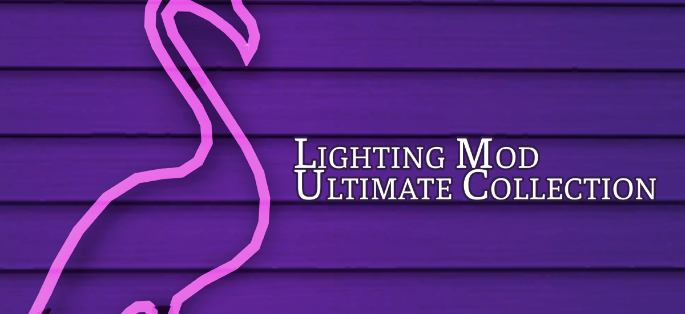

# **Lighting Mod Ultimate Collection**

## ABOUT

*(Yes, it’s a reference to the Sims 2 Ultimate Collection because…it is indeed an ultimate collection)*

The ***Lighting Mod Ultimate Collection*** is a lighting mod/framework that allows players to switch lighting configurations on a lot-level basis.

Now, the game itself already utilizes lot-level lighting as far back as Nightlife for Downtown lots, and some lighting mods have combined this with the usage of cheat aliases to use different lighting configurations that potentially suit different lots of neighborhoods, or using different lighting color definitions (as in Cinema Secrets’s implementation of World Lit by Fire), or the lighting direction changes in Maxis Match Lighting Mod.

However, the Lighting Mod Ultimate Collection takes this a step further and features five lighting mods in one setup. This means one installation and you can switch from one config to another on the fly.

Now, given the limitations of how lighting files are loaded, I used Cinema Secrets’s configuration as the base configuration, but ported as many configurations from the other lighting mods as I could while maintaining its stability. This means the only things that change from one mode to another are:

- Seasons lighting
- Time of day lighting (night, dusk, dawn)
- Lighting object definitions (the configurations that define what kind of light an object would have
- Some global definitions

Neighborhood lighting is the same across modes, as is CAS lighting, debug lighting, and certain global configurations

## **LIGHTING MODS**

### 1. Cinema Secrets (DEFAULT)

This is the one I personally use, and is sort of a middle ground between more maxis-styled lighting and more realistic and dramatic lighting mods like the Radiance Lighting System. It aims to keep the stuff I like with MM Lighting Mod, but integrate some aspects I like in the Radiance Lighting Mod and try to fix issues that plagued both.

Cinema Secrets is the default lighting you will end up in if you don't switch to another mode.

### 2. World Lit by Fire (Cinema Secrets version)

This is a adaptation of the Radiance Lighting System tweaks by Almighty Hat that aims to add a candle light cast to all lights in the game that aren't supposed to be electric. However, I took this a step further and converted some of the electric lights to SoftAmber (if it makes sense).

Everything else is still based on Cinema Secrets.

### 3. Maxis Match Lighting Mod

Maxis Match (MM) Lighting Mod is a lighting configuration mod for The Sims 2 that aims to improve on vanilla Maxis lighting, while at the same time retain its very essence. It had taken a life of its own ever since but it's still very maxis-matchy and uses Maxis lighting configuration across the board.

### 4. Radiance Lighting System

The Radiance Lighting System, according to its original creator GunMod, is an "Enhanced lighting system for the Sims 2." that uses physics laws of light to ensure the most realistic lighting possible within the game.

The original mod has very dramatic lights and very dark darks, but I've put my own spin into it, adding in Radiance Lighting System fixes and tweaks on top of the 2.4 version by dDefender - dusk and dawn by bugjartimedecay-off, seasons and nights from my old RLS 2.5 system, and the unlit rooms are somewhere in between the original version of RLS and Raemia’s tweaks of the night lighting. I also added in some of the changes from the "Sims 2 Beta Lighting" mod by BoringBones.

### 5. World Lit by Fire (Radiance version)

This is the original Radiance 2.4 based version by Almighty Hat. Unlike the original version of this tweak, you can switch to regular radiance and World Lit by Fire using cheats.

### 5. Vanilla Plus

This is basically just Vanilla lighting with the lighting fixes from plasticbox and CircusWolf, dusk and dawn by spookymuffinsims, and the portal lighting fixes for dusk and dawn and vacation lighting from kayleigh83 she did for MM Lighting Mod.

## LIGHTING DIRECTION

All lighting mods have the option for you to change the lighting direction of the lot depending on where you want the bright part of the lot to be. The sun orientation of a lot is semi-hardcoded at the lot level, so if you're aiming for sun accuracy, or you want a certain side of the lot to catch the sun, you can change the lighting direction. 

*Unlike Hook's original lighting direction files, however, my implementation of the lighting direction doesn't just affect the daytime lighting, but **morning, evening, and night lighting** as well.*

> NOTE: The lot in the preview photo's Sun orientation is facing at the front of the lot. If your lot's original sun orientation is not facing front, your results may vary.

|                                                      |                                                      |
|------------------------------------------------------|------------------------------------------------------|
| 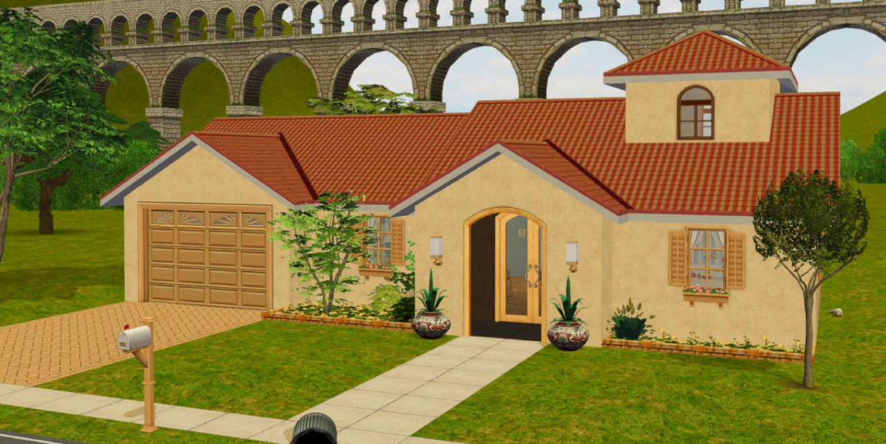<br/>**Front** | 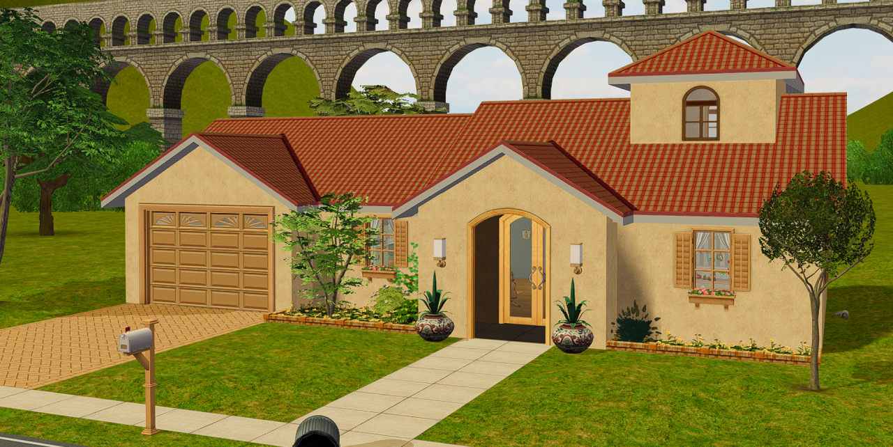<br/>**Right** |
| 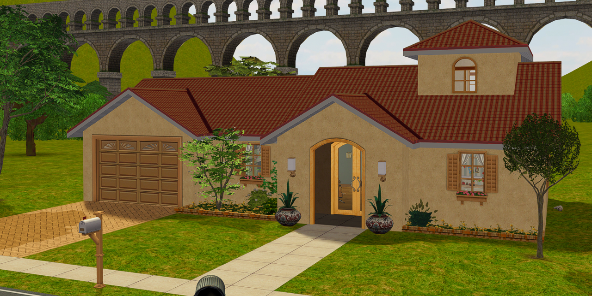<br/>**Back**   | 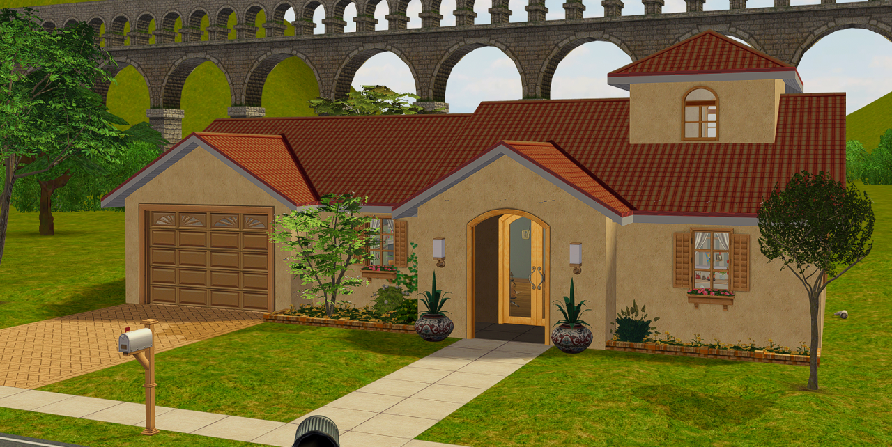<br/>**Left**   |


## **LIGHTING COMPARISON:**

> NOTE: Screenshots use the shaders from my "Recommended Mods" section below. Unedited photos are available on my [Tumblr](https://www.tumblr.com/veronavillequiltingbee/817412867195338752).

| Lighting Mod                                | Day                                               | Night                                               |                                
|---------------------------------------------|---------------------------------------------------|-----------------------------------------------------|
| Vanilla Plus                                | 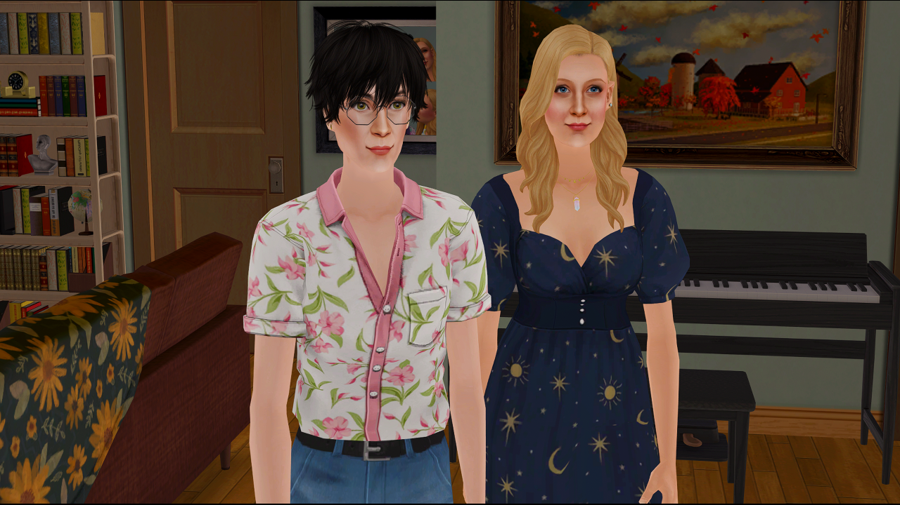   | 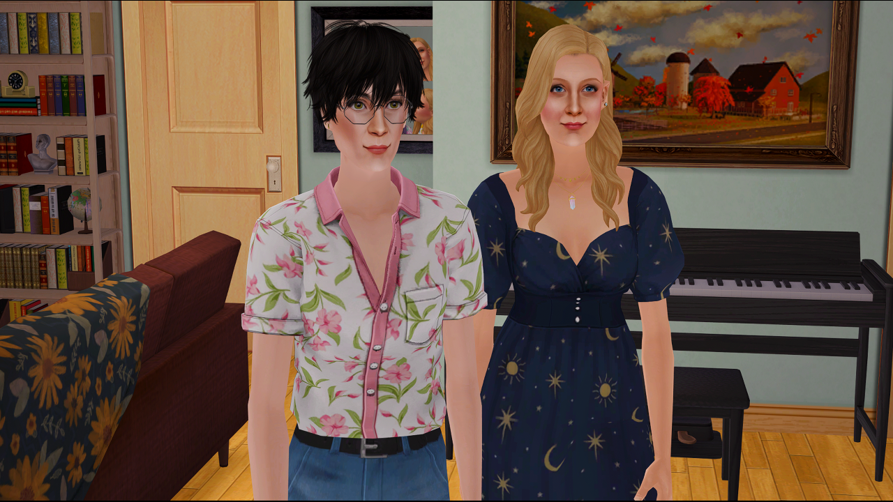   |
| Maxis Match Lighting Mod                    | 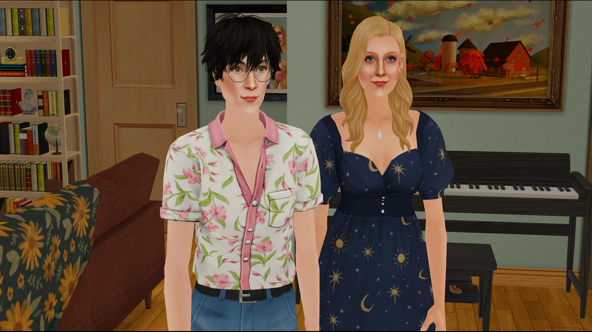   | 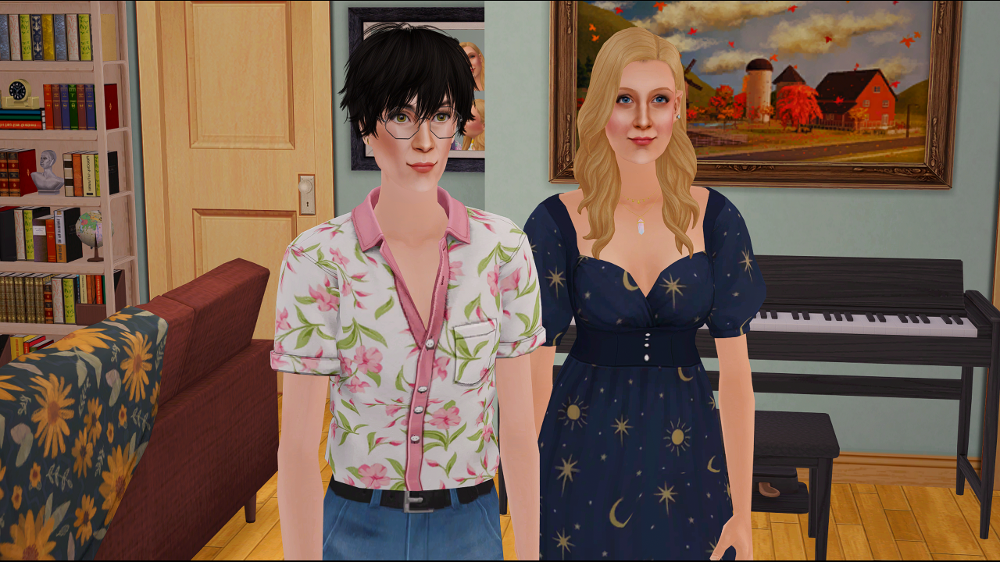   |
| Radiance Lighting System                    | 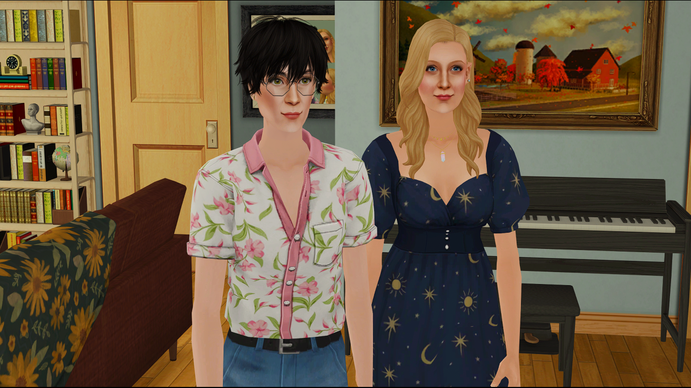  | 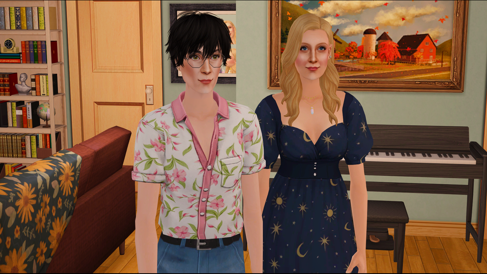  |
| Cinema Secrets                              | 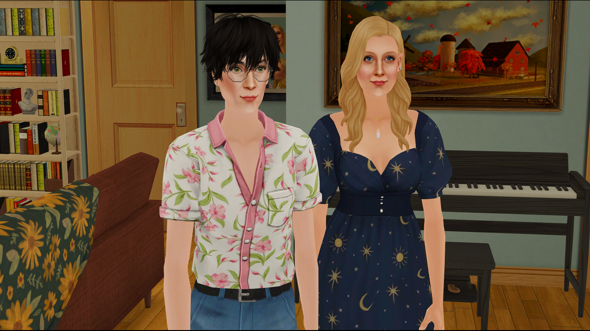   | 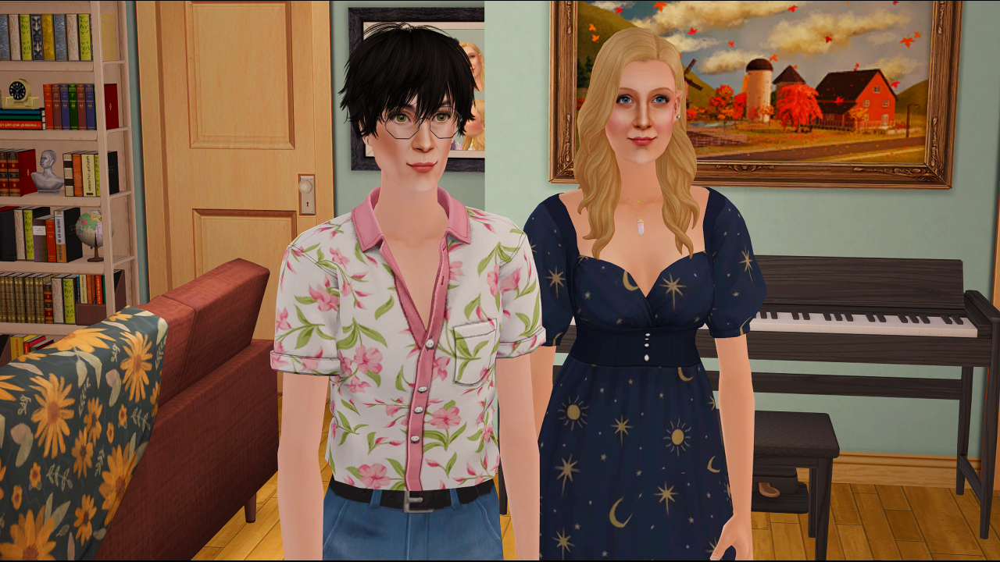   |
| World Lit by Fire (based on Cinema Secrets) |  |  |

## **GAME INSTALLATION FOLDERS**

The way the lighting mod is structured that unlike the vanilla lighting, where there's a `Lighting.txt` and `EPXLighting.nlo` files (sometimes, like in the case for Nightlife, multiple of them) for each EP is that for most of the EPs, every single NLO file is empty except for Base Game (which contains the bare minimum configuration and some common values shared across lighting configurations), and the latest EP, which in this case is Mansion and Garden Stuff (which contains the EP lighting definitions, plus many of the major lighting settings that can safely be placed in that folder without breaking lighting settings. Assuming the mod is installed correctly, you will only need to touch the BG and M&G folders. 

### **Ultimate Collection**

- Base Game:
   - `Program Files (x86)\Origin Games\The Sims 2 Ultimate Collection\Double Deluxe\Base` (for the Origin version)
   - `MagiPacks\The Sims 2\Double Deluxe\Base` (for the MagiPack repack)
   - `Program Files (x86)\The Sims 2 Starter Pack\Double Deluxe\Base` (for Osab's repack)
- Mansion and Garden:
    - `Program Files (x86)\Origin Games\The Sims 2 Ultimate Collection\Fun with Pets\SP9`
    - `MagiPacks\The Sims 2\Fun with Pets\SP9` (for the MagiPack repack)
    - `Program Files (x86)\The Sims 2 Starter Pack\Fun with Pets\SP9` (for Osab's repack)

### **Legacy Collection**

- Base Game:
   - `Program Files (x86)\Steam\steamapps\common\The Sims 2 Legacy Collection\Base` (for the Steam version)
   - `Program Files\EA Games\The Sims 2 Legacy Collection\Base` (for the EA App version)
- Mansion and Garden:
   - `Program Files (x86)\Steam\steamapps\common\The Sims 2 Legacy Collection\EP9` (for the Steam version)
   - `Program Files\EA Games\The Sims 2 Legacy Collection\EP9` (for the EA App version)

### **Disc Version**

- Base Game:
   - `Program Files (x86)\EA GAMES\The Sims 2` (for regular Sims 2)
   - `Program Files (x86)\EA GAMES\The Sims 2 Deluxe\Base` (for Sims 2 Deluxe)
   - `Program Files (x86)\EA GAMES\The Sims 2 Double Deluxe\Base` (for Sims 2 Double Deluxe)
- Mansion and Garden:
   - `Program Files (x86)\EA GAMES\The Sims 2 Mansion and Garden Stuff` (for all version)

## **LIGHTS FOLDER LOCATION**

The Lights folder is located under `TSData\Res\Lights` under each Game Installation Folder.

## **DOWNLOAD INSTRUCTIONS**

Download and unzip the latest release from the [Releases](https://github.com/thedreadpirates/ts2-lighting-mod-uc/releases) page.

## **INSTALLATION INSTRUCTIONS**

****

These steps assume that you have already extracted the files to an accessible location and (if desired) have installed The Scriptorium with the Maxis lights option.

1. If you plan on installing the Scriptorium, install that first (with the Maxis lights option) because the Scriptorium installer will overwrite your lighting files. If you use any custom lighting mods, delete the contents of your BASE GAME Lights folder AND your Mansion and Garden Lights folder in your Game Installation folders first.

2. If you are an Ultimate Collection user, copy ALL THE CONTENTS of folder 1.0 to your game installation folder (usually found in Origin Games\The Sims 2 Ultimate Collection) and skip to STEP 5. This applies whether the game was obtained officially or unofficially (IYKYK).

3. If you installed TS2 from disk (aka if you have THe Sims 2 Mansion and Garden Stuff folder), click on the folder labeled 2.0, then copy the contents to your game installation folder (usually found in Program Files [or Program Files (x86)]\EA Games)

    - IF the Base Game, Nightlife, and Celebrations! Stuff are in separate folders, copy the CONTENTS of the folder labeled 2.1 to your game installation folder
    - ELSE IF you have a folder named “The Sims 2 Deluxe”, copy the CONTENTS of the folder labeled 2.2
    - ELSE IF you have a folder named “The Sims 2 Double Deluxe”, copy the CONTENTS of the folder labeled 2.3

4. If you have the Legacy Collection, copy the contents of the folder labeled 3.0 to your game installation folder. After this, immediately jump to STEP 5.

5. Copy the lines inside the `userStartup.cheat` file provided to your `userStartup.cheat` if you have the file, otherwise copy the userStartup.cheat provided to your `Documents\EA Games\The Sims 2\Config` folder, if you don’t.

6. Copy the contents of the folder labeled 4.0 to your downloads folder. These contain the fixed Store lights.

## **SWITCHING LIGHTING MODS:**

Simply type the cheat alias on the cheat console (CTRL + SHIFT + C) to switch while on a lot. The default configuration for each lighting mod has the sun orientation at the front of the lot.

- `sld` - default lighting (`Lighting.txt`)
- `slv` - Vanilla Plus (`Lighting_Vanilla.txt`)
- `slm` - Maxis Match lighting mod (`Lighting_MM.txt`)
- `slr` - Radiance Lighting (`Lighting_RLS.txt`)
- `slw` - World Lit by Fire - Cinema Secrets base (`Lighting_WLBF.txt`)
- `slc` - Cinema Secrets (`Lighting_CS.txt`)
- `slf` - World Lit by Fire - Radiance base (`Lighting_RLS_WLBF.txt`)

The lot lighting persists between saves unless you clear it with `setlotlightingfile clear` (or `sld`).

## **SWITCHING LIGHTING DIRECTIONS**

To switch lighting directions (Back, Left, Right), type the following cheats:

| **Lighting Mod**                        | **Front (default)** | **Back** | **Left** | **Right** |
|-----------------------------------------|---------------------|----------|----------|-----------|
| Default                                 | `sld` or `sldf`     | `sldb`   | `sldl`   | `sldr`    |
| Cinema Secrets                          | `slc` or `slcf`     | `slcb`   | `slcl`   | `slcr`    |
| Radiance Lighting System                | `slr` or `slrf`     | `slrb`   | `slrl`   | `slrr`    |
| Maxis Match Lighting Mod                | `slm` or `slmf`     | `slmb`   | `slml`   | `slmr`    |
| Vanilla Plus                            | `slv` or `slmf`     | `slvb`   | `slvl`   | `slvr`    |
| World Lit by Fire (Cinema Secrets base) | `slw` or `slwf`     | `slwb`   | `slwl`   | `slwr`    |
| World Lit by Fire (Radiance base)       | `slf` or `slff`     | `slfb`   | `slfl`   | `slfr`    |

## **SWITCHING DEFAULT LIGHTING MODS**

The mod uses Cinema Secrets by default, but you can switch to any of the other lighting mods by following these steps:

1. Go to your Mansion and Garden Lights folder.

2. Copy the original `Lighting.txt` file and rename to `Lighting_bak.txt`

3. Open `Lighting.txt` file and look for the first `sinclude` line and change it to any of the following:

    - Cinema Secrets - `Lighting_CS.txt`
    - World Lit by Fire (Cinema Secrets base) - `Lighting_WLBF.txt`
    - Maxis Match Lighting Mod - `Lighting_MM.txt`
    - Radiance Lighting System - `Lighting_RLS.txt`
    - World Lit by Fire (Radiance base) - `Lighting_RLS_WLBF.txt`
    - Vanilla Plus - `Lighting_Vanilla.txt`

4. Save.

5. Repeat Steps 2-4 with `Lighting_Back.txt`, `Lighting_Left.txt`, and `Lighting_Right.txt`, changing the first `sinclude` line with the corresponding light direction file for each lighting mod.

5. If your game is open, key in CTRL+SHIFT+C, then type `sld`

## **UPDATING INSTRUCTIONS:**

1. To update the lighting mod, delete all files (EXCEPT Scriptorium-related files, if you have them) in your BASE GAME and MANSION & GARDEN Lights folders, then place the updated files inside.
2. If there are any cheat updates, delete all lines related to lighting from your userStartup.cheat file and replace with the lines in the updated userStartup.cheat.

## Current Cheat Configuration

```
#### LIGHTING CHEATS ####
ignoreErrors true
boolProp UseShaders true
boolProp specHighlights true
boolProp floorAndWallNormalMapping true
boolProp bumpMapping true
boolProp skipTangentsInVertexData false      #false for bumpmapping!
uintProp optionLightingQuality 3             #These two lines set the lighting option and
uintProp LightingQuality 3                   #the lighting level to MAX (as required)
boolProp gpuCompositing true
floatProp geomBoneInfluenceThreshold 0.01
floatProp geomPerBoneBoundBlendWeightThreshold 0.9
boolProp geomCheckGeomDataIntegrity false
boolProp geomGenerateTangentSpaceSxT true
##########################

#### LIGHTING ALIASES ####
alias sld "setlotlightingfile clear" "Default Lighting" "Default Lighting - front"
alias sldf "setlotlightingfile clear" "Default Lighting" "Default Lighting - front"
alias sldb "setlotlightingfile Lighting_Back.txt" "Default Lighting - Back" "Default Lighting - Back"
alias sldl "setlotlightingfile Lighting_Left.txt" "Default Lighting - Left" "Default Lighting - Left"
alias sldr "setlotlightingfile Lighting_Right.txt" "Default Lighting - Right" "Default Lighting - Right"

alias slw "setlotlightingfile Lighting_WLBF.txt" "a world lit by fire" "A World Lit by Fire - front"
alias slwf "setlotlightingfile Lighting_WLBF.txt" "a world lit by fire" "A World Lit by Fire - front"
alias slwb "setlotlightingfile Lighting_WLBF_Back.txt" "a world lit by fire - Back" "A World Lit by Fire - Back"
alias slwl "setlotlightingfile Lighting_WLBF_Left.txt" "a world lit by fire - Left" "A World Lit by Fire - Left"
alias slwr "setlotlightingfile Lighting_WLBF_Right.txt" "a world lit by fire - Right" "A World Lit by Fire - Right"

alias slm "setlotlightingfile Lighting_MM.txt" "maxis match lighting mod" "Maxis Match Lighting Mod - front"
alias slmf "setlotlightingfile Lighting_MM.txt" "maxis match lighting mod" "Maxis Match Lighting Mod - front"
alias slmb "setlotlightingfile Lighting_MM_Back.txt" "maxis match lighting mod - Back" "Maxis Match Lighting Mod - Back"
alias slml "setlotlightingfile Lighting_MM_Left.txt" "maxis match lighting mod - Left" "Maxis Match Lighting Mod - Left"
alias slmr "setlotlightingfile Lighting_MM_Right.txt" "maxis match lighting mod - Right" "Maxis Match Lighting Mod - Right"

alias slv "setlotlightingfile Lighting_Vanilla.txt" "vanilla plus lighting mod" "Vanilla Plus Lighting - front"
alias slvf "setlotlightingfile Lighting_Vanilla.txt" "vanilla plus lighting mod" "Vanilla Plus Lighting - front"
alias slvb "setlotlightingfile Lighting_Vanilla_Back.txt" "vanilla plus lighting mod - Back" "Vanilla Plus Lighting - Back"
alias slvl "setlotlightingfile Lighting_Vanilla_Left.txt" "vanilla plus lighting mod - Left" "Vanilla Plus Lighting - Left"
alias slvr "setlotlightingfile Lighting_Vanilla_Right.txt" "vanilla plus lighting mod - Right" "Vanilla Plus Lighting - Right"

alias slr "setlotlightingfile Lighting_RLS.txt" "radiance lighting system" "Gunmod Radiance Lighting System - front"
alias slrf "setlotlightingfile Lighting_RLS.txt" "radiance lighting system" "Gunmod Radiance Lighting System - front"
alias slrb "setlotlightingfile Lighting_RLS_Back.txt" "radiance lighting system - back" "Gunmod Radiance Lighting System - back"
alias slrl "setlotlightingfile Lighting_RLS_Left.txt" "radiance lighting system - left" "Gunmod Radiance Lighting System - left"
alias slrr "setlotlightingfile Lighting_RLS_Right.txt" "radiance lighting system - right" "Gunmod Radiance Lighting System - right"

alias slf "setlotlightingfile Lighting_RLS_WLBF.txt" "a world lit by fire (radiance base) - front" "a world lit by fire (radiance base) - front"
alias slff "setlotlightingfile Lighting_RLS_WLBF.txt" "a world lit by fire (radiance base) - front" "a world lit by fire (radiance base) - front"
alias slfb "setlotlightingfile Lighting_RLS_WLBF_Back.txt" "a world lit by fire (radiance base) - back" "a world lit by fire (radiance base) - front"
alias slfl "setlotlightingfile Lighting_RLS_WLBF_Left.txt" "a world lit by fire (radiance base) - left" "a world lit by fire (radiance base) - left"
alias slfr "setlotlightingfile Lighting_RLS_Right.txt" "radiance lighting system - right" "Gunmod Radiance Lighting System - right"

alias slc "setlotlightingfile Lighting_CS.txt" "cinema secrets lighting mod" "Cinema Secrets Lighting Mod - front"
alias slcf "setlotlightingfile Lighting_CS.txt" "cinema secrets lighting mod" "Cinema Secrets Lighting Mod - front"
alias slcb "setlotlightingfile Lighting_CS_Back.txt" "cinema secrets lighting mod - back" "Cinema Secrets Lighting Mod - back"
alias slcl "setlotlightingfile Lighting_CS_Left.txt" "cinema secrets lighting mod - left" "Cinema Secrets Lighting Mod - left"
alias slcr "setlotlightingfile Lighting_CS_Right.txt" "cinema secrets lighting mod - right" "Cinema Secrets Lighting Mod - right"
##########################
```

## **UNINSTALLATION INSTRUCTIONS**

1. Delete the contents of the LIGHTS folder for both BASE GAME and MANSION and GARDEN.
2. Copy the contents of the [Lights Backup](http://www.mediafire.com/file/elcrtdl6kx0x0sq/Lights_Backup.7z/file) file according to your game setup (UC, Legacy, or Disk).

## **OPTIONAL STEPS:**

### **Disable Dusk/Dawn Lighting**

1. Go to your BASE GAME Lighting.txt and look for the following line:
```
setb morningEvening true
```
2. Change `true` to `false`.
3. Save changes.

### **Use Day CAS Lighting**

For those who use a CAS replacement with custom lighting setup, you might want to turn off the CAS lights:

1. Go to the MANSION and GARDEN Lights Folder
2. Go to the `_Overrides` folder then `Overrides.nlo`
3. Change the following lines from 0 to 1.
```
seti FamilyAreaOff 0
seti PodiumAreaOff 0
```
4. Save.

This should apply across all lighting mod configurations.

## **RECOMMENDED MODS**

First two I highly recommend. The others are nice to have.

- [Accurate Neighborhood Terrain Lighting](https://modthesims.info/d/654677/accurate-neighborhood-terrain-lighting.html): Matches neighborhood lighting with lot lighting. Use the versions suffixed with “-lightingremedy”
- [Blue Snow Fix](https://dreadpirate.tumblr.com/post/179182314487/blue-snow-no-more-shader-fixes-ive-included): Winter snow at night is blue. Very blue. This fixes it. If you want to use some water mods or roof shader mods, options are also available. I use EA roofs and Voeille's lot and neighborhood water
- [StandardMaterial Shader](https://crispsandkerosene.tumblr.com/post/758562617469091841/extended-standardmaterial-shader-for-the-sims-2). Improves on the shaders that render objects. If you want to use this mod, use this shader instead of the “main” shaders in the snow fixes.
- [Extended SimStandardMaterial Shader](https://crispsandkerosene.tumblr.com/post/768598233529434112/extended-simstandardmaterial-shader-for-the-sims-2)): Has several fixes that enable shiny textures on clothing, etc. I personally use the brighter sims version, but either is great.

## **CREDITS**

- @spookymuffinsims, for your lighting mod that served as a base for the maxis match lighting mod that started this all
- @nightracer for the base of the Seasonal Lighting Tweaks
- @criquette-was-here, for the different shader and hood lighting tweaks
- @bugjartimedecayoff for the base for night, dusk and dawn lighting
- @simnopke for the SkyFix, and the valuable feedback
- Gunmod, ChocolatePi, Ddefinder for the hard work on the Radiance Lighting System
- Plasticbox and CircusWolf for the object lighting fixes used in Vanilla Plus and Maxis Match Lighting Mod
- Almighty Hat for the World Lit By Fire tweak for Radiance, which I adapted for this mod
- @teaaddictyt and others in the Tea Addict Discord server for the valuable testing and feedback
- BoringBones for the TS2 Beta Lighting changes
- HugeLunatic for the much better M&G chandelier fix
- Hook, for the lighting direction changes
